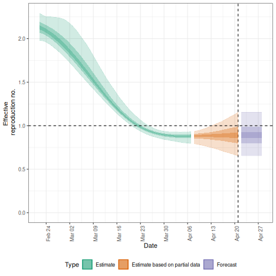
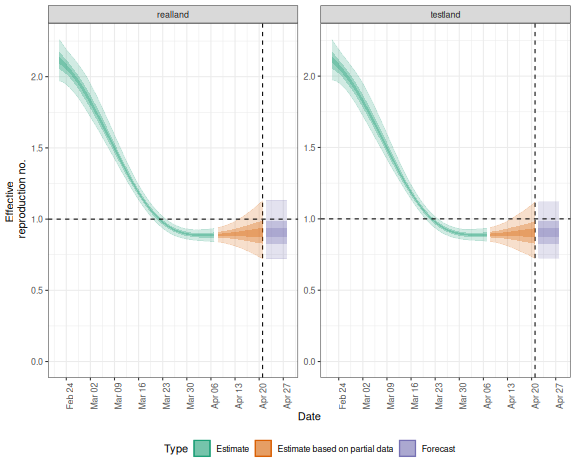
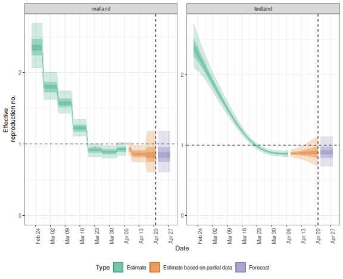

The _EpiNow2_ package contains functionality to run `estimate_infections()` in production mode, i.e. with full logging and saving all relevant outputs and plots to dedicated folders in the hard drive.
This is done with the `epinow()` function, that takes the same options as `estimate_infections()` with some additional options that determine, for example, where output gets stored and what output exactly.
The function can be a useful option when, e.g., running the model daily with updated data on a high-performance computing server to feed into a dashboard.
For more detail on the various model options available, see the [Examples](estimate_infections_options.html) vignette, for more on the general modelling approach the [Workflow](estimate_infections_workflow.html), and for theoretical background the [Model definitions](estimate_infections.html) vignette

# Running the model on a single region

To run the model in production mode for a single region, set the parameters up in the same way as for `estimate_infections()` (see the [Workflow](estimate_infections_workflow.html) vignette).
Here we use the example delay and generation time distributions that come with the package.
This should be replaced with parameters relevant to the system that is being studied.


``` r
library("EpiNow2")
#> 
#> Attaching package: 'EpiNow2'
#> The following object is masked from 'package:stats':
#> 
#>     Gamma
options(mc.cores = 4)
reported_cases <- example_confirmed[1:60]
reporting_delay <- LogNormal(mean = 2, sd = 1, max = 10)
delay <- example_incubation_period + reporting_delay
rt_prior <- LogNormal(mean = 2, sd = 0.1)
```

We can then run the `epinow()` function with the same arguments as `estimate_infections()`.


``` r
res <- epinow(reported_cases,
  generation_time = generation_time_opts(example_generation_time),
  delays = delay_opts(delay),
  rt = rt_opts(prior = rt_prior)
)
#> Logging threshold set at INFO for the name logger
#> Writing EpiNow2 logs to the console and:
#> '/tmp/RtmpszeI3E/regional-epinow/2020-04-21.log'.
#> Logging threshold set at INFO for the name logger
#> Writing EpiNow2.epinow logs to the console and:
#> '/tmp/RtmpszeI3E/epinow/2020-04-21.log'.
#> WARN [2025-02-01 00:50:17] epinow: The `filter_leading_zeros` argument of `estimate_infections()` is deprecated as of EpiNow2 1.7.0. - 
#> WARN [2025-02-01 00:50:17] epinow: The `zero_threshold` argument of `estimate_infections()` is deprecated as of EpiNow2 1.7.0. - 
#> WARN [2025-02-01 00:51:12] epinow: The largest R-hat is NA, indicating chains have not mixed.
#> Running the chains for more iterations may help. See
#> https://mc-stan.org/misc/warnings.html#r-hat - 
#> WARN [2025-02-01 00:51:13] epinow: Bulk Effective Samples Size (ESS) is too low, indicating posterior means and medians may be unreliable.
#> Running the chains for more iterations may help. See
#> https://mc-stan.org/misc/warnings.html#bulk-ess - 
#> WARN [2025-02-01 00:51:14] epinow: Tail Effective Samples Size (ESS) is too low, indicating posterior variances and tail quantiles may be unreliable.
#> Running the chains for more iterations may help. See
#> https://mc-stan.org/misc/warnings.html#tail-ess -
res$plots$R
```



The initial messages here indicate where log files can be found.
If you want summarised results and plots to be written out where they can be accessed later you can use the `target_folder` argument.

# Running the model simultaneously on multiple regions

The package also contains functionality to conduct inference contemporaneously (if separately) in production mode on multiple time series, e.g. to run the model on multiple regions.
This is done with the `regional_epinow()` function.

Say, for example, we construct a dataset containing two regions, `testland` and `realland` (in this simple example both containing the same case data).


``` r
cases <- example_confirmed[1:60]
cases <- data.table::rbindlist(list(
  data.table::copy(cases)[, region := "testland"],
  cases[, region := "realland"]
 ))
```

To then run this on multiple regions using the default options above, we could use


``` r
region_rt <- regional_epinow(
  data = cases,
  generation_time = generation_time_opts(example_generation_time),
  delays = delay_opts(delay),
  rt = rt_opts(prior = rt_prior),
)
#> INFO [2025-02-01 00:51:16] Producing following optional outputs: regions, summary, samples, plots, latest
#> Logging threshold set at INFO for the name logger
#> Writing EpiNow2 logs to the console and:
#> '/tmp/RtmpszeI3E/regional-epinow/2020-04-21.log'.
#> Logging threshold set at INFO for the name logger
#> Writing EpiNow2.epinow logs to: '/tmp/RtmpszeI3E/epinow/2020-04-21.log'.
#> INFO [2025-02-01 00:51:16] Reporting estimates using data up to: 2020-04-21
#> INFO [2025-02-01 00:51:16] No target directory specified so returning output
#> INFO [2025-02-01 00:51:16] Producing estimates for: testland, realland
#> INFO [2025-02-01 00:51:16] Regions excluded: none
#> INFO [2025-02-01 00:52:14] Completed estimates for: testland
#> INFO [2025-02-01 00:53:17] Completed estimates for: realland
#> INFO [2025-02-01 00:53:17] Completed regional estimates
#> INFO [2025-02-01 00:53:17] Regions with estimates: 2
#> INFO [2025-02-01 00:53:17] Regions with runtime errors: 0
#> INFO [2025-02-01 00:53:17] Producing summary
#> INFO [2025-02-01 00:53:17] No summary directory specified so returning summary output
#> INFO [2025-02-01 00:53:17] No target directory specified so returning timings
## summary
region_rt$summary$summarised_results$table
#>      Region New infections per day Expected change in daily reports
#>      <char>                 <char>                           <fctr>
#> 1: realland    2292 (1348 -- 3928)                Likely decreasing
#> 2: testland    2286 (1363 -- 3931)                Likely decreasing
#>    Effective reproduction no.           Rate of growth
#>                        <char>                   <char>
#> 1:         0.91 (0.72 -- 1.1) -0.026 (-0.095 -- 0.045)
#> 2:          0.9 (0.72 -- 1.1) -0.028 (-0.094 -- 0.044)
#>    Doubling/halving time (days)
#>                          <char>
#> 1:             -26 (15 -- -7.3)
#> 2:             -25 (16 -- -7.4)
## plot
region_rt$summary$plots$R
```



If instead, we wanted to use the Gaussian Process for `testland` and a weekly random walk for `realland` we could specify these separately using the `opts_list()` function from the package and `modifyList()` from `R`.


``` r
gp <- opts_list(gp_opts(), cases)
gp <- modifyList(gp, list(realland = NULL), keep.null = TRUE)
rt <- opts_list(rt_opts(), cases, realland = rt_opts(rw = 7))
region_separate_rt <- regional_epinow(
  data = cases,
  generation_time = generation_time_opts(example_generation_time),
  delays = delay_opts(delay),
  rt = rt, gp = gp,
)
#> INFO [2025-02-01 00:53:18] Producing following optional outputs: regions, summary, samples, plots, latest
#> Logging threshold set at INFO for the name logger
#> Writing EpiNow2 logs to the console and:
#> '/tmp/RtmpszeI3E/regional-epinow/2020-04-21.log'.
#> Logging threshold set at INFO for the name logger
#> Writing EpiNow2.epinow logs to: '/tmp/RtmpszeI3E/epinow/2020-04-21.log'.
#> INFO [2025-02-01 00:53:18] Reporting estimates using data up to: 2020-04-21
#> INFO [2025-02-01 00:53:18] No target directory specified so returning output
#> INFO [2025-02-01 00:53:18] Producing estimates for: testland, realland
#> INFO [2025-02-01 00:53:18] Regions excluded: none
#> INFO [2025-02-01 00:54:23] Completed estimates for: testland
#> INFO [2025-02-01 00:54:53] Completed estimates for: realland
#> INFO [2025-02-01 00:54:53] Completed regional estimates
#> INFO [2025-02-01 00:54:53] Regions with estimates: 2
#> INFO [2025-02-01 00:54:53] Regions with runtime errors: 0
#> INFO [2025-02-01 00:54:53] Producing summary
#> INFO [2025-02-01 00:54:53] No summary directory specified so returning summary output
#> INFO [2025-02-01 00:54:53] No target directory specified so returning timings
## summary
region_separate_rt$summary$summarised_results$table
#>      Region New infections per day Expected change in daily reports
#>      <char>                 <char>                           <fctr>
#> 1: realland    2023 (1030 -- 4199)                Likely decreasing
#> 2: testland    2259 (1356 -- 3897)                Likely decreasing
#>    Effective reproduction no.           Rate of growth
#>                        <char>                   <char>
#> 1:          0.85 (0.6 -- 1.2)  -0.041 (-0.11 -- 0.044)
#> 2:           0.9 (0.7 -- 1.1) -0.028 (-0.096 -- 0.042)
#>    Doubling/halving time (days)
#>                          <char>
#> 1:             -17 (16 -- -6.2)
#> 2:             -25 (16 -- -7.2)
## plot
region_separate_rt$summary$plots$R
```


